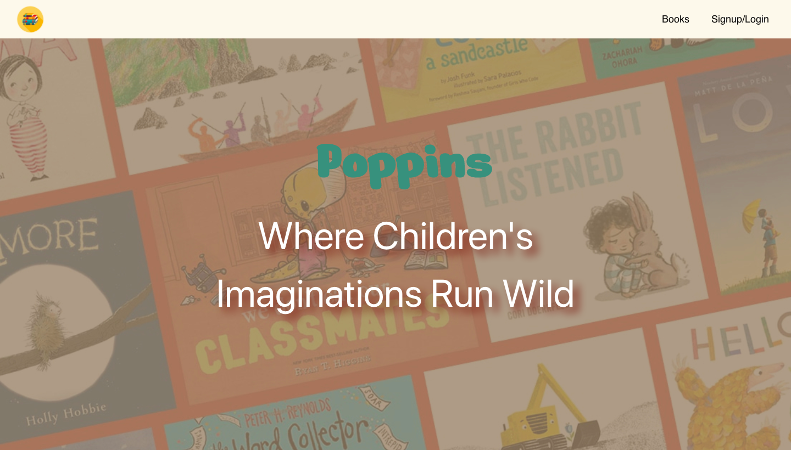

# Poppins | Overview

This was our final project at the General Assembly Software Engineering Immersive course. For this project I was in a group of three we had to create a full stack app using the things we learnt for the past few weeks. The project required my team member to create an API with Python and Flask, using a Flask REST framework to serve our data from a Postgres database. We built a separate frontend using React, and deployed the website online.

# Brief

* Build a full-stack application by making our own backend and our own frontend.
* Create Our own API from scratch.
* Work in a group of three, using Git to code collaboratively.
* Use a Python Flask API to serve our data from a Postgres database.
* Create a complete product, which meant multiple relationships and CRUD functionality .
* Consider user stories/wireframes and identifying the features that were core to MVP.
* Ensure we developed a visually impressive design.
* Deploy our app online.

# Technologies Used

* Python
* React
* JavaScript (ES6)
* Sass
* HTML
* APIs
* Insomnia
* Heroku
* VS Code
* Git and GitHub

# Approach

We initially spent some time working out what project we wanted to do, and we had a few different ideas. We decided on a website called Poppins, named after Mary Poppins, which would allow parents to rate books that their children have read, and would allow them to choose what book their children might like to read next, based on the comments of other parents.

We next looked at the functionality that we would need in order to reach a minimum viable project. This included users signing up and logging in so that they can comment on other books, and we realised the user would need to be able to add their own books to the library well.

We also decided the user would likely want to sort the books by age category and genre for the website to have maximum use. This functionality means that the user will be able to genuinely use the site and find the perfect book for their children.

A neat feature was to include a link to Google Books, which displays the first few pages of each book. This was included through an API, with a button appearing under each book that invites the user to ‘read more’.

We looked at some stretch goals as well, and this included introducing an external API so that we would have a large number of books in the library. And we considered a rating system where books could be marked out of five or ten.

# The Frontend

I manage to do most of the CSS for this project. These are the pages i created: 

* Home-Page
* Login/Sign-up
* Books page

# Screenshots

Below is an image of the Home page.

On the next page shows the list of all the books. It's a colourful page because children’s books are inherently bright by design.

Here is the some of the code for the Single Page:

# Lessons Learned

We learnt a lot more about working together to produce a finished product. Breaking the work down into sections that each of us could tackle wasn’t too difficult, but by its nature this project meant we would often be working in the same files and this created a few conflicts that we had to think about before we could choose which option we wanted to keep. This was clearly down to experience, and was partly down to writing code that was properly laid out (particularly around indentations) and was easy to read. My experience as a journalist and a writer means I understand the importance of making sure what we right in code is clear and concise.

We worked hard to ensure the functionality was perfect, but that meant we didn’t leave much time for the styling. It can be difficult to get the balance right because ultimately the styling is what people see when they visit the site, but at least we can relax in the knowledge that it all works properly!

I was already aware that taking a step-by-step process was critical, but this project really underlined the idea that I had to test every part of the code as it was written. Going step by step was much better than writing a lot of code and later spending time trying to find out where there was a problem.

I used Insomnia to work out exactly how the code for writing and submitting comments was working, and I’ve included a screenshot over the page that shows a highlight of the project for me - when the comments would appear on the write book with the write user ID.

# Potential Future Features

We would like to incorporate an external API so that we can dramatically expand the number of books available. One challenge to this was the lack of available APIs that focus on books, and this is something that we should have considered in more detail when we began the project.

We have also considered how we could set up a ‘book swap’ function, which would allow users to swap books with each other. This would be relatively easy to do because you could simply install a chat feature, or you could do it a more complex way that involved the user establishing a wish list of books they’d like to borrow.

