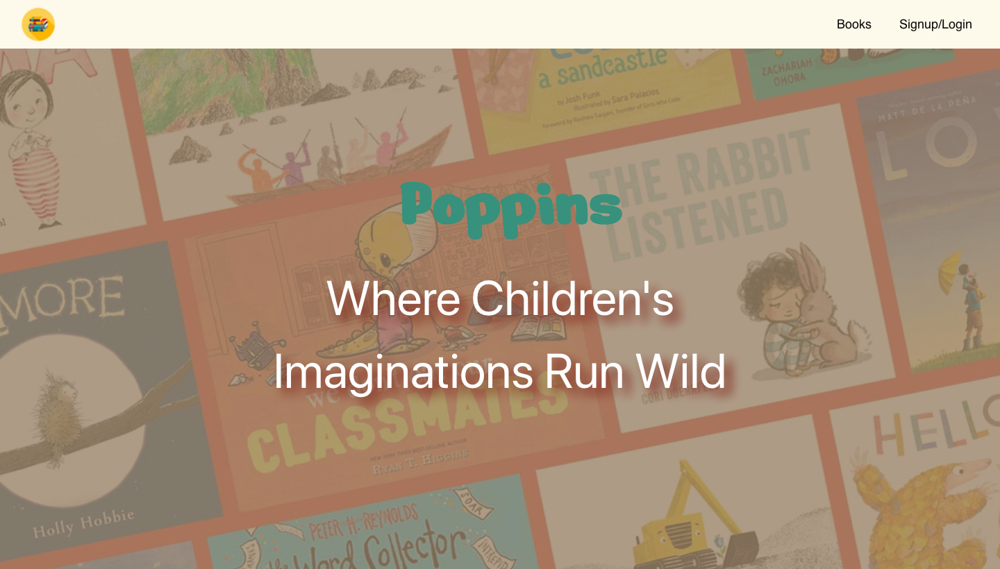
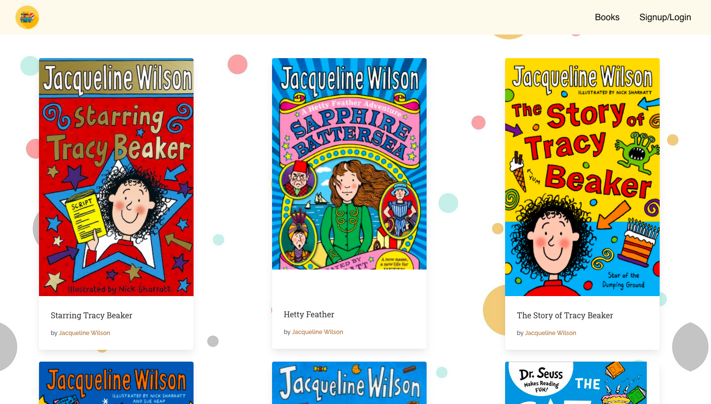
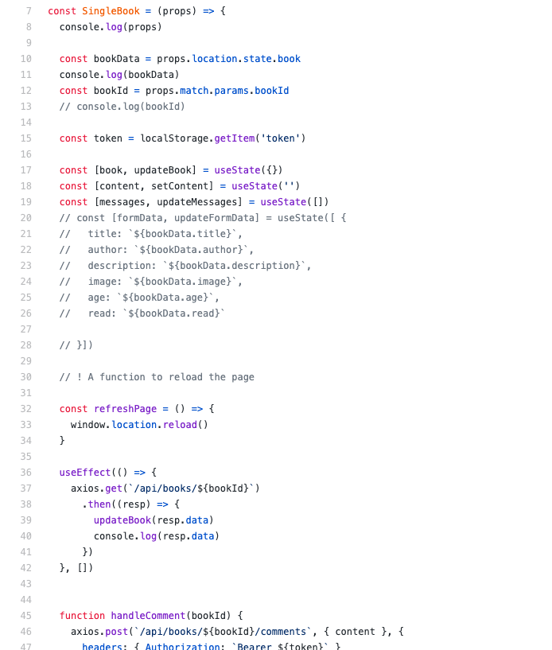

# Poppins | Overview

This was our final project at the General Assembly Software Engineering Immersive course. For this project I was in a group of three we had to create a full stack app using the things we learnt for the past few weeks. The project required my team member to create an API with Python and Flask, using a Flask REST framework to serve our data from a Postgres database. We built a separate frontend using React, and deployed the website online.

You can view my project live here ---> https://poppinsbook.herokuapp.com/

# Brief

* Build a full-stack application by making our own backend and our own frontend.
* Create Our own API from scratch.
* Work in a group of three, using Git to code collaboratively.
* Use a Python Flask API to serve our data from a Postgres database.
* Create a complete product, which meant multiple relationships and CRUD functionality .
* Consider user stories/wireframes and identifying the features that were core to MVP.
* Ensure we developed a visually impressive design.
* Deploy our app online.

# Technologies Used

* Python
* React
* JavaScript (ES6)
* Sass
* HTML
* APIs
* Insomnia
* Heroku
* VS Code
* Git and GitHub

# Approach

We initially spent some time working out what project we wanted to do, and we had a few different ideas. We decided on a website called Poppins, named after Mary Poppins, which would allow parents to rate books that their children have read, and would allow them to choose what book their children might like to read next, based on the comments of other parents.

We next looked at the functionality that we would need in order to reach a minimum viable project. This included users signing up and logging in so that they can comment on other books, and we realised the user would need to be able to add their own books to the library well.

We also decided the user would likely want to sort the books by age category and genre for the website to have maximum use. This functionality means that the user will be able to genuinely use the site and find the perfect book for their children.

A neat feature was to include a link to Google Books, which displays the first few pages of each book. This was included through an API, with a button appearing under each book that invites the user to ‘read more’.

We looked at some stretch goals as well, and this included introducing an external API so that we would have a large number of books in the library. And we considered a rating system where books could be marked out of five or ten.
# Backend

For this website, we use our own API that we created. I mainly did the seeding file for the project and got the book information, description and images from the internet. Here is a screenshot of the seed.py page.

# The Frontend

I manage to do most of the CSS for this project. These are the pages i created: 

* Home-Page
* Login/Sign-up
* Books page

# Screenshots

Below is an image of the Home page.

On the next page shows the list of all the books. It's a colourful page because children’s books are inherently bright by design.

Here is the some of the code for the Single Page:

# Challenges + Lessons Learned

We learned a lot more about working together to create a finished product. It wasn't too difficult to break down the project into parts that each of us could handle, but this project meant by its design that we would always work in the same files and this generated a few conflicts that we had to think about before we could choose which choice we wanted to hold.

We worked hard to make sure the features were fine, but that meant that we didn't leave much time for the styling. It can be hard to get the balance correct because what people see when they visit the site is ultimately the styling, but at least we can trust in the knowledge that it all works properly!

# Future Features

In order to significantly increase the number of books available, we would like to incorporate an external API. The lack of available APIs that concentrate on books was one obstacle to this, and this is something that we should have discussed in more depth before we started the project.

